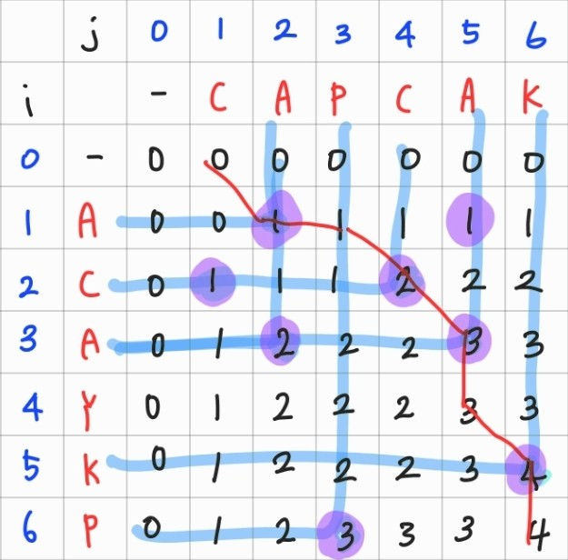

## Info
<a href="https://www.acmicpc.net/problem/9251" rel="nofollow">9251 LCS</a>

## 풀이
`LCS(최장 공통 부분 수열)`이란 두 수열이 주어졌을 때 모두의 부분 수열이 되는 수열 중 `가장 긴 것`을 찾는 문제이다.

연속으로 공통되는 것은 상관없고, 순서만 지키면 되는 것으로 이해했다.

`LCS`을 공부하며 실제로 예제에 적용하여 2차원 배열을 갱신해보았다. 이 과정에서 규칙을 찾았는데, `A[i]`와 `B[j]` 문자가 동일한 경우, `dp[i-1][j-1]`에 1을 더해주어 갱신하였다. 

예시로 `dp[3][2]` 전에는 `C`만 일치하였는데, `dp[3][2]`에서 새롭게 `A`가 추가되었으므로 `dp[2][1]`에서 +1하였다. `dp[2][1]`의 공통 부분 수열은 `C`이기 때문이다. `dp[5][6]`은 `dp[4][5]`에서는 `ACA`였으나, `K`가 추가된 것이므로 `ACAK` 즉 `4`로 갱신된 것을 알 수 있다.

`A[i]`와 `B[j]` 문자가 동일하지 않은 경우, `dp[i-1][j]`와 `dp[i][j-1]` 중 더 큰 값을 선택한다.

## 마무리
`LCS` 구현 방법을 검색해보고 공부하는 시간을 가지게 되었다.